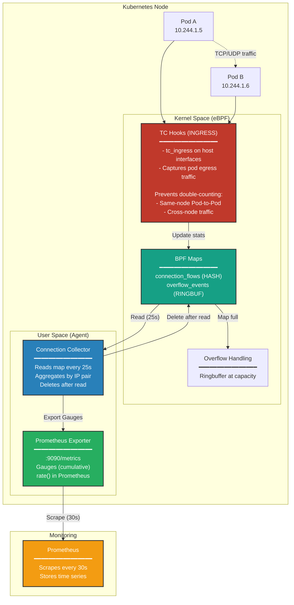
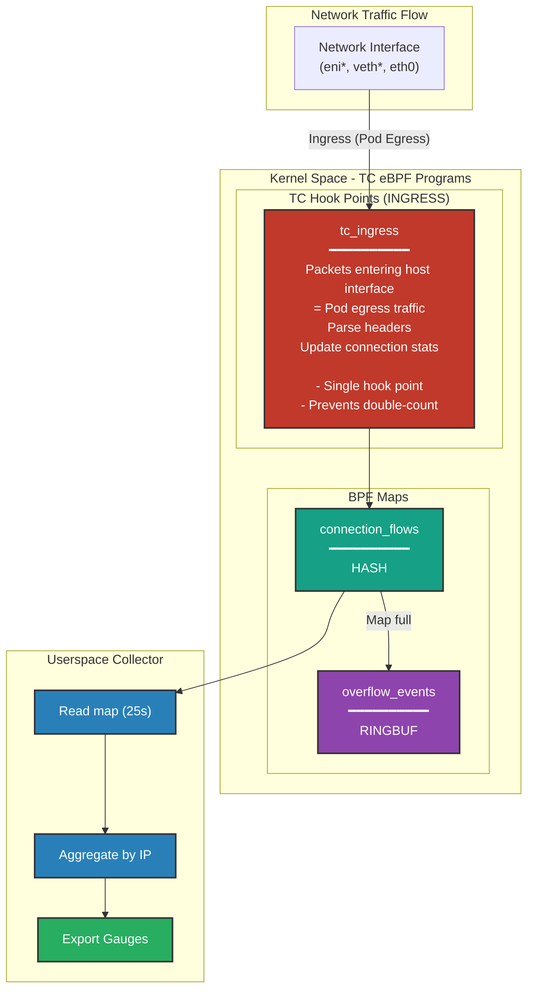

# Architecture Documentation

This document provides detailed technical architecture information for the KubeAdapt eBPF Network Metrics Agent.

## High-Level Architecture



## Low-Level eBPF Architecture



## Data Flow & Metric Export

### Metrics Data Flow

```
┌─────────────────────────────────────────────────────────────────┐
│                        METRICS ARCHITECTURE                     │
└─────────────────────────────────────────────────────────────────┘

BPF Kernel Maps         Userspace Collector      Prometheus Server
─────────────────       ───────────────────      ─────────────────

┌──────────────┐        ┌───────────────┐        ┌──────────────┐
│ connection_  │        │ Connection    │        │ Prometheus   │
│ flows        │───────>│ Collector     │        │ Server       │
│ (HASH map)   │  Read  │               │        │              │
│              │  Every │ - Reads map   │        │ HTTP GET     │
│ Cumulative   │  25s   │ - Aggregates  │<───────┤ /metrics     │
│ byte/packet  │        │ - Deletes     │ Scrape │ Every 30s    │
│ counters     │        │               │        │              │
└──────────────┘        │ Updates       │        └──────────────┘
                        │ Prometheus    │               │
┌──────────────┐        │ Registry      │               │
│ overflow_    │        │ (in-memory)   │               │
│ events       │───────>│               │               ▼
│ (ringbuffer) │ Events │ Gauges/       │        ┌──────────────┐
│              │        │ Counters      │        │ Time Series  │
└──────────────┘        └───────┬───────┘        │ Database     │
                                │                │ (TSDB)       │
                                │                └──────────────┘
                                ▼
                        ┌───────────────┐
                        │ /metrics      │
                        │ HTTP Endpoint │
                        │               │
                        │ Exposes text  │
                        │ format for    │
                        │ scraping      │
                        └───────────────┘
```

### Connection Tracking Flow

```
┌─────────────────────────────────────────────────────────────┐
│ Step 1: Packet Arrives at Network Interface                 │
│ ━━━━━━━━━━━━━━━━━━━━━━━━━━━━━━━━━━━━━━━━━━━━━━━━━━━━━━━━━  │
│ TC ingress hook attached to host interface (eni*/veth*)    │
│ → Parse Ethernet + IP + TCP/UDP headers                    │
│ → Extract 5-tuple: src_ip, dst_ip, src_port, dst_port, proto│
│ → Get packet size (IP header + payload)                    │
└─────────────────────────────────────────────────────────────┘
                            ↓
┌─────────────────────────────────────────────────────────────┐
│ Step 2: Traffic Tracked (Kernel Accumulation - POD EGRESS)  │
│ ━━━━━━━━━━━━━━━━━━━━━━━━━━━━━━━━━━━━━━━━━━━━━━━━━━━━━━━━━  │
│ tc_ingress: Packet entering host interface (1000 bytes)    │
│ → Lookup connection in map                                  │
│ → Check if same interface (IfIndexFirstSeen dedup)         │
│ → __sync_fetch_and_add(&stats->bytes, 1000)               │
│ → __sync_fetch_and_add(&stats->packets, 1)                │
│ → stats->last_seen_ns = now()                              │
│                                                             │
│ NOTE: Kernel maintains cumulative counters (never reset)   │
│ NOTE: Single hook point prevents same-node & cross-node 2x │
└─────────────────────────────────────────────────────────────┘
                            ↓
┌─────────────────────────────────────────────────────────────┐
│ Step 3: Userspace Collection (Every 25s)                    │
│ ━━━━━━━━━━━━━━━━━━━━━━━━━━━━━━━━━━━━━━━━━━━━━━━━━━━━━━━━━  │
│ Iterate connection_flows map:                               │
│   Key: {10.244.1.5:45678 → 10.244.1.6:80, TCP}            │
│   Stats: {bytes: 5000, packets: 5} (pod egress)            │
│                                                             │
│ Aggregate by (src_ip, dst_ip, protocol):                   │
│   Remove ports → (10.244.1.5, 10.244.1.6, TCP)            │
│   Sum all connections with same IPs                        │
│                                                             │
│ Export Counter (cumulative - pod egress):                  │
│   kubeadapt_connection_traffic_bytes_total{                │
│     src_ip="10.244.1.5",                                   │
│     dst_ip="10.244.1.6",                                   │
│     protocol="tcp",                                        │
│     daemonset_pod_uid="abc-123-def",                       │
│     daemonset_node_name="worker-1"                         │
│   } = 5000                                                  │
│                                                             │
│ DELETE entry from BPF map (read-then-delete pattern)       │
│ → Prevents data loss for short-lived connections           │
│ → Map cleared every 25s (fresh window)                     │
└─────────────────────────────────────────────────────────────┘
                            ↓
┌─────────────────────────────────────────────────────────────┐
│ Step 4: Next Window (25s Later)                             │
│ ━━━━━━━━━━━━━━━━━━━━━━━━━━━━━━━━━━━━━━━━━━━━━━━━━━━━━━━━━  │
│ If connection still active:                                 │
│ → New accumulation starts (bytes reset to 0 in map)        │
│ → Prometheus sees new window with fresh byte counts        │
│                                                             │
│ If connection closed before collection:                     │
│ → Entry was already in map during last collection          │
│ → Data was captured (no loss)                              │
│ → Next collection: entry not present (window ended)        │
│                                                             │
│ Prometheus rate() calculation:                             │
│ → Calculates per-second rate across windows                │
│ → Handles window transitions automatically                 │
└─────────────────────────────────────────────────────────────┘
```

## Counter Metrics with Read-Then-Delete Pattern

The agent uses **Prometheus Counters** to export cumulative byte/packet metrics. This design combines kernel-side accumulation with userspace delta reporting.

### Kernel-Side Accounting (Cumulative Counters)

- eBPF programs maintain **cumulative counters** in kernel space using atomic operations (`__sync_fetch_and_add`)
- Each connection tracks total bytes/packets sent since connection creation
- Kernel state accumulates until entry is read and deleted (read-then-delete pattern)

### Userspace Exports Deltas (Counters)

- The collector reads BPF maps every 25 seconds and extracts **delta values** for each connection
- After reading, entries are **deleted from the map** (read-then-delete pattern)
- Deltas are added to Prometheus Counters using `.Add(delta)`
- Prometheus Counter maintains cumulative state automatically

### Why Counters (Not Gauges)?

```go
// Counter approach (current implementation):
delta := kernelCumulativeValue  // Read from BPF map
counterMetric.Add(delta)        // Prometheus maintains cumulative state
// Delete entry from BPF map (map cleared every 25s)
```

**Advantages of Counters:**
- **Correct semantics**: Counters are monotonically increasing (matches intent)
- **Built-in reset handling**: Prometheus automatically handles Counter resets
- **No userspace state**: BPF map is cleared each cycle (no persistent state)
- **PromQL compatibility**: `rate()` and `increase()` functions designed for Counters

### Prometheus Rate Calculation

```
Time Series Example (25s Collection Windows):
━━━━━━━━━━━━━━━━━━━━━━━━━━━━━━━━━━━━━━━━━━━━━━━━━━━━━━━━━━
t=0s:   Collection #1 reads map
        Connection active, accumulated 5000 bytes → Gauge = 5000
        Entry DELETED from map after read

t=25s:  Collection #2 reads map
        Connection still active, accumulated 4000 bytes (new window) → Gauge = 4000
        Entry DELETED from map after read

t=50s:  Collection #3 reads map
        Connection closed before this collection
        Entry not in map → Gauge drops (no value exported)

t=75s:  Collection #4 reads map
        No connection → No metric exported

Prometheus Query: rate(kubeadapt_connection_traffic_bytes_total[1m])
━━━━━━━━━━━━━━━━━━━━━━━━━━━━━━━━━━━━━━━━━━━━━━━━━━━━━━━━━━
t=0-25s:  5000 bytes / 25s = 200 bytes/sec
t=25-50s: 4000 bytes / 25s = 160 bytes/sec
t=50s+:   Connection ended, rate drops to 0

✅ Windowed collection - each window is independent
✅ No data loss for short-lived connections (captured in window)
✅ Read-then-delete pattern prevents race conditions
✅ Prometheus handles window transitions automatically
```

### Real-World Example

```
Kernel BPF Map (cumulative within window):
━━━━━━━━━━━━━━━━━━━━━━━━━━━━━━━━━━━━━━
t=0-25s:  Connection active
          BPF map: bytes = 5000 (accumulated over 25s)
          Collection reads 5000 → Counter.Add(5000)
          Entry DELETED from map

t=25-50s: Connection still active
          BPF map: bytes = 3000 (new window, fresh accumulation)
          Collection reads 3000 → Counter.Add(3000)
          Entry DELETED from map

t=50s+:   Connection closed
          Entry not in map → No update

Prometheus Counter State:
━━━━━━━━━━━━━━━━━━━━━━━━━━━━━━━━━━━━━━
After t=25s:  counter_total = 5000
After t=50s:  counter_total = 8000 (5000 + 3000)
After t=75s:  counter_total = 8000 (no change)

PromQL rate() Calculation:
━━━━━━━━━━━━━━━━━━━━━━━━━━━━━━━━━━━━━━
rate(counter_total[1m]) at t=50s = (8000 - 5000) / 25s = 120 bytes/sec
```

## References

- [Linux Kernel TC Documentation](https://www.kernel.org/doc/html/latest/networking/filter.html)
- [Linux Kernel BPF Documentation](https://www.kernel.org/doc/html/latest/bpf/)
- [Cilium eBPF Library Documentation](https://pkg.go.dev/github.com/cilium/ebpf)
